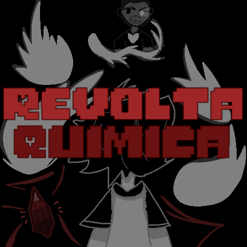

# Revolta Química

  

Jogo de combate estilo **Touhou/Undertale** desenvolvido como parte do projeto final da disciplina de **Programação Orientada a Objetos** no curso técnico em Informática no **Instituto Federal da Paraíba - Campus Esperança**.

## Sobre o Projeto

**Revolta Química** é a terceira e última fase do projeto maior **[Ctrl Esc Game Over](https://github.com/yago26/Ctrl-Esc-Game-Over)**, desenvolvido em equipe durante o primeiro semestre de 2025.

O jogo é inspirado nos sistemas de combate de Undertale e nos padrões de projéteis (bullet hell) de Touhou, utilizando **p5.js** como engine gráfica e de som.

### Premissa

Em **fevereiro de 2025**, no Campus Esperança, o protagonista (um monitor de química, eu) atrasa a entrega do relatório final da monitoria. Diante desse cenário catastrófico, não resta alternativa: é preciso enfrentar o professor orientador em uma batalha campal para redimir a situação. A química será tanto sua arma quanto sua defesa.

## Funcionalidades

- **Sistema de combate** inspirado em Undertale (ações de menu + dodging de projéteis)
- **Múltiplos ataques** do jogador baseados em conceitos químicos (Oxidação-Redução, Força Iônica, Entalpia Explosiva)
- **Projéteis inimigos** temáticos (Átomos, Descarga, Estequiometria, Energias, Feixe Inorgânico, Explosão)
- **Sistema de diálogos** com caixas de texto estilo RPG
- **Cenas de cutscene** com transições narrativas
- **Sistema de cenários** com múltiplas fases

## Tecnologias Utilizadas

| Tecnologia | Uso |
|------------|-----|
| [p5.js](https://p5js.org/) | Engine principal (gráficos, input, áudio) |
| [p5.sound](https://p5js.org/reference/#/p5.Sound) | Gerenciamento de áudio e música |
| HTML/CSS | Estrutura e estilo da página |
| JavaScript (ES6) | Lógica do jogo com POO |

## Como Jogar

1. Abra o arquivo `index.html`
2. Use o mouse para navegar nos menus e selecionar ações
3. Na fase de combate:
   - **Ataque** — Use as setas do teclado para mirar e acertar o inimigo
   - **Defenda** — Desvie dos projéteis inimigos usando as setas ou WASD
4. Gerencie sua vida (HP) e derrote o professor para concluir a monitoria

## Créditos

Projeto desenvolvido por alunos do curso técnico em Informática do **Instituto Federal da Paraíba - Campus Esperança**.

**Disciplina:** Programação Orientada a Objetos

**Projeto pai:** [Ctrl Esc Game Over](https://github.com/yago26/Ctrl-Esc-Game-Over)

## Licença

Este projeto é um trabalho acadêmico e tem fins educacionais.
